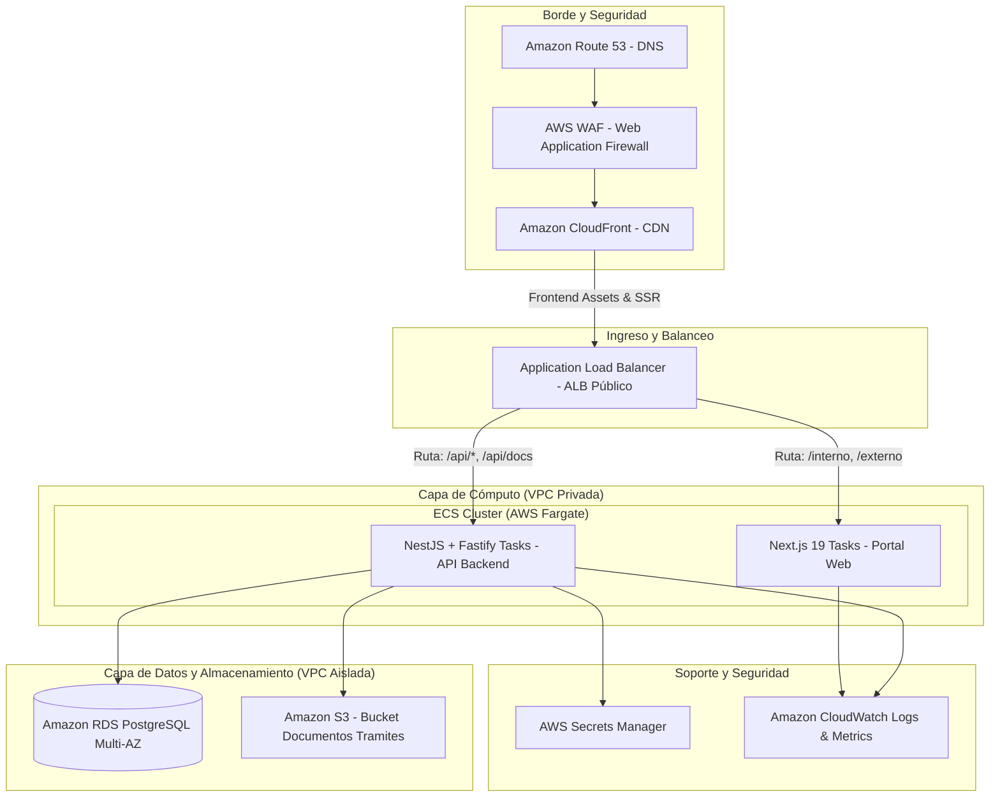

# PROPUESTA DE DESPLIEGUE EN AWS (AWS DEPLOYMENT ARCHITECTURE)

> **Sistema**: BPM de Trámites de Oficina  
> **Modelo**: Cloud-Native, Alta Disponibilidad, Escalabilidad Elástica y Seguridad en Profundidad  

---

## 1. Visión General de la Arquitectura



---

## 2. Componentes y Servicios de AWS

### 2.1. Cómputo: AWS ECS con AWS Fargate
- **Contenedores Serverless**: Despliegue de los contenedores Docker de Backend (NestJS + Fastify) y Frontend (Next.js 19) sin gestionar instancias EC2 subyacentes.
- **Auto Scaling**:
  - Backend: Políticas basadas en CPU (> 70%) y número de peticiones concurrentes por target group.
  - Frontend: Políticas basadas en utilización de memoria y tráfico HTTP.
- **Task Definitions**:
  - Inyección de secretos directamente desde AWS Secrets Manager a nivel de variables de entorno de la tarea.

### 2.2. Base de Datos: Amazon RDS para PostgreSQL
- **Configuración Multi-AZ**: Réplica síncrona en una segunda zona de disponibilidad para conmutación por error automática ante fallas de hardware o mantenimiento.
- **Storage Autoscaling**: Almacenamiento SSD gp3 con crecimiento automático de volumen.
- **Backups Automatizados**: Retención de 7 a 30 días con Point-In-Time Recovery (PITR) y snapshots diarios.
- **Red Aislada**: Subnets de base de datos privadas sin acceso a Internet, accesibles únicamente desde las tareas ECS del backend mediante Security Groups específicos.

### 2.3. Balanceo y Distribución: ALB + CloudFront + WAF
- **AWS WAF**: Reglas gestionadas contra inyecciones SQL (SQLi), Cross-Site Scripting (XSS), bad bots y límite de tasa de solicitudes (rate limiting).
- **Amazon CloudFront**: Distribución global de contenido estático (assets de Next.js, imágenes, estilos) con terminación SSL/TLS y compresión Brotli/Gzip.
- **Application Load Balancer (ALB)**:
  - Terminación de certificados TLS gestionados por AWS Certificate Manager (ACM).
  - Enrutamiento basado en path:
    - `/api/*` y `/api/docs` dirigidos al Target Group de Backend (puerto 3001).
    - `/*` dirigido al Target Group de Frontend (puerto 3000).
  - Health checks automáticos hacia `/api/health`.

### 2.4. Almacenamiento de Documentos: Amazon S3
- Bucket dedicado para archivos adjuntos de trámites (`DocumentoTramite`).
- **Seguridad**:
  - Bloqueo de acceso público total (`Block Public Access`).
  - Cifrado en reposo con AWS KMS (SSE-KMS).
  - URLs prefirmadas (Pre-Signed URLs) de corta duración generadas por el backend para descarga segura de documentos.
  - Políticas de ciclo de vida para transición de documentos históricos a S3 Standard-IA / Glacier.

### 2.5. Gestión de Secretos y Configuración: AWS Secrets Manager
- Almacenamiento centralizado de:
  - `DATABASE_URL` con credenciales rotativas de PostgreSQL.
  - `JWT_SECRET` para firma de tokens externos.
  - Parámetros de integración de Azure Entra ID (`AZURE_TENANT_ID`, `AZURE_CLIENT_ID`, `AZURE_CLIENT_SECRET`).

### 2.6. Observabilidad: Amazon CloudWatch
- CloudWatch Logs: Agrupamiento de logs JSON generados por Fastify y Next.js.
- CloudWatch Alarms: Notificaciones SNS a equipo de guardia ante picos de latencia, fallos de healthcheck o aumento de códigos HTTP 5xx.
- CloudWatch Container Insights para monitorización de rendimiento de tareas ECS.

---

## 3. Estrategia de Migraciones de Base de Datos
- Las migraciones de Prisma se ejecutan como una **ECS One-Off Task** antes de desplegar las nuevas tareas de backend en el cluster:
  ```bash
  aws ecs run-task \
    --cluster bpm-tramites-cluster \
    --task-definition bpm-api-migration-task \
    --launch-type FARGATE ...
  ```
- La tarea ejecuta `prisma migrate deploy`.
- Si la migración es exitosa, el pipeline de CI/CD procede con la actualización del servicio ECS (`aws ecs update-service`).
- Si la migración falla, el despliegue se detiene automáticamente, evitando que código nuevo se conecte a un esquema desactualizado.

---

## 4. Estrategia de Rollback
- **Rollback de Cómputo**:
  - Mediante ECS Service Deployment: Reversión instantánea a la revisión anterior del Task Definition (`bpm-api:revision-anterior`).
- **Rollback de Esquema**:
  - Políticas de migración no destructiva (dos fases: agregar columna opcional -> migrar -> deprecar).
  - En emergencias mayores, restauración desde snapshot de RDS mediante PITR a un momento previo al despliegue.
